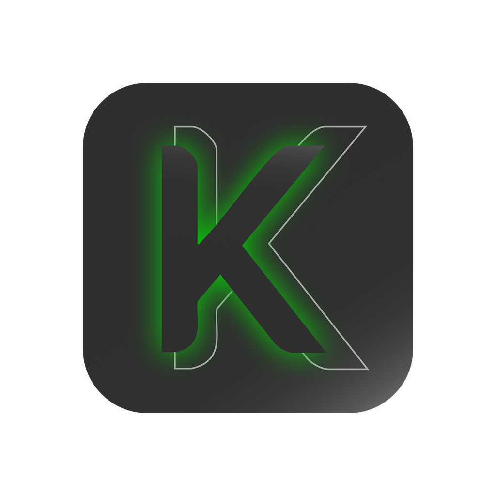

<p align="center">
  
</p>

<h1 align="center"> KONTROL App</h1>

<p align="center">
  <strong>Convierte tu smartphone en un gamepad de Xbox 360 de alto rendimiento y cero latencia.</strong>
</p>

<p align="center">
  
  
  
  
  
</p>

---

**KONTROL** es un ecosistema híbrido que une la potencia del hardware de PC con la versatilidad de los smartphones actuales. Permite conectar hasta 4 dispositivos móviles simultáneamente a una PC, emulando controles físicos mediante WebSockets de máxima velocidad.

## ✨ Características Premium
- 🎮 **Multi-jugador Simultáneo**: Hasta 4 jugadores en la misma red Wi-Fi sin colisión de paquetes.
- ⚡ **Latencia Mínima (H-Bridge)**: Motor de comunicación por sockets puros, procesando entradas cada 16ms.
- 🏎️ **Modos de Control Híbridos**: Mando Clásico y modo Carreras Pro.
- 📳 **Haptic Engine Nativo**: Retroalimentación táctil y vibración física en colisiones de juegos.
- 🖥️ **Fallback UI Inyectable**: Si ocurre un error, levanta una interfaz web interna de gestión local en `localhost:8080`.

---

## 🚀 Instalación y Despliegue Express (1-Clic)

Se acabaron las instalaciones manuales aburridas. Abre tu terminal y pega una sola línea de código; el sistema descargará los binarios, instalará controladores necesarios y dejará un acceso directo nativo brillante en tu Escritorio de forma automática.

### 🪟 Windows (Powershell)
Abre PowerShell y pega esto:
```powershell
powershell -Command "iwr https://raw.githubusercontent.com/NewKeyth/Kontrol-app/main/install.ps1 -UseBasicParsing | iex"
```

### 🐧 Linux (Bash)
Abre tu Terminal y pega esto:
```bash
curl -sL https://raw.githubusercontent.com/NewKeyth/Kontrol-app/main/install.sh | bash
```

### 📱 Instalación del Celular (Android)
Abre la pestaña de **[Releases]** en GitHub desde tu celular y descarga la `KONTROL_App.apk`. Instálala, conéctate al mismo Wi-Fi y digita la IP que aparece en la computadora.

---

## 🛠️ Estructura de la Arquitectura
*KONTROL fue reestructurado bajo metodologías de Screaming Architecture:*
- 🧠 `/main.py`: Entrypoint lógico y orquestador del servidor central y WebSockets.
- 🏎️ `/gamepad_driver.py`: Abstracción agnóstica de hardware (vgamepad para Windows, evdev para Linux).
- 🖥️ `/desktop_ui`: Interfaz Web para gestión y dashboard en PC (HTML/CSS/JS Vainilla).
- 📱 `/mobile_app`: Aplicación móvil desarrollada en React Native y Expo para Android/iOS.
- 📝 `/docs`: Documentación detallada de arquitectura técnica y diagramas.

---

## 🚀 El Corazón de KONTROL: Visión, Diseño y Determinación

Este proyecto no es solo código; es una declaración de intenciones. Nace de un **estudiante de Ingeniería en Sistemas y Diseño UI/UX** que cree fervientemente que la falta de conocimiento técnico profundo no debe ser una barrera para la innovación.

### 💡 Mi Filosofía de Desarrollo
- **Determinación ante todo:** El no saber programar profesionalmente "todavía" no me iba a detener. KONTROL es la prueba de que con una visión clara y las herramientas correctas, se pueden materializar ideas que resuelvan necesidades reales.
- **Foco en el Diseño (UI/UX):** Mi fuerte y mi pasión. He dedicado este proyecto a demostrar cómo una interfaz intuitiva y una experiencia de usuario pulida pueden transformar una herramienta simple en un producto de alta gama.
- **El Futuro: Dirección de Productos Digitales:** Aspiro a liderar y dirigir la creación de productos tecnológicos. Mi objetivo es ser el puente entre el diseño, la tecnología y el negocio, asegurando que cada producto no solo funcione, sino que encante al usuario.
- **IA como Co-Piloto:** El código fuente ha sido desarrollado con el apoyo estratégico de **Inteligencia Artificial**. Para mí, la IA no reemplaza al creador, sino que potencia su capacidad de ejecución mientras continúo mi formación técnica.

---
<p align="center">Creado con 💻 y ☕ por Keyber.</p>
